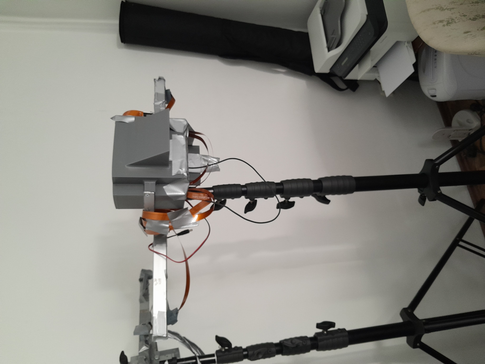
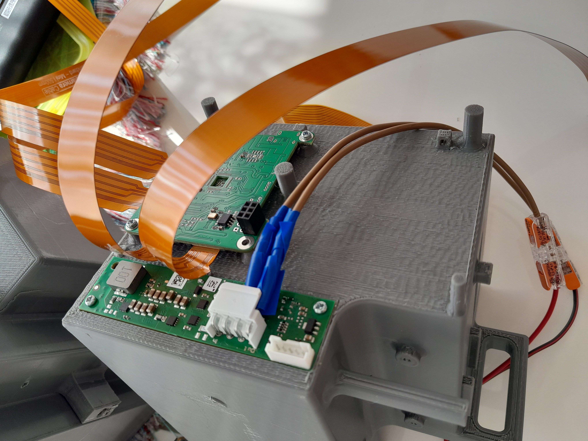

The aim of this project is to create an Embedded AI Camera System for automated offside detection in football. Therefore I constructed two camera systems, each one equipped with 4 cameras, where each camera had an unique and precisely calculated tilt and pan. Each camera system was based on a tripod, which could be extended up to 7 meters height. My embedded system could very well act full-automated or semi-automated (Human-in-the-Loop), which is the standard at current professional football. Automated offside detection systems are expensive, here I designed a very cheap version thus potentially allowing even small budget teams to buy it. The current (semi) automated offside systems are very expensive, thus only the top professional leagues have it, with our approach even amateur leagues could have such sophisticated systems for a cheap price.

The first prototype is done, but it is still under development and has currently been put on hold due to a lack of budget, time and priority.
